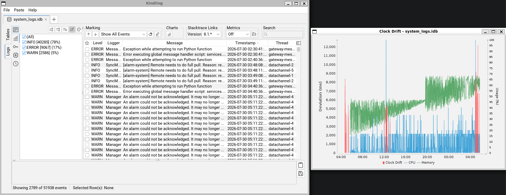
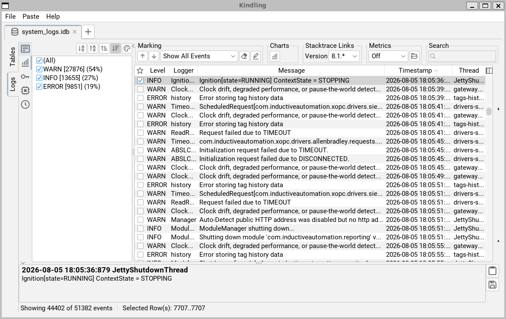

# Log viewer features (fork)

Five additions to the log viewer, built on upstream `main`. Each has its own
branch. This branch, `demo`, has all five merged so they can be run together.

None of this has been submitted upstream yet.



## Who did what

The code on these branches was written by an AI coding agent
([Claude Code](https://claude.com/claude-code)), working under my direction.
Each feature's commit carries its co-author trailer.

My work was:

- deciding which problems were worth solving
- deciding how each feature should behave for someone reading gateway logs
- designing the way of working: a sequence of phases, each one there to
  avoid or soften a failure that AI-assisted coding is prone to. They are
  described in [How it was built](how-it-was-built.md).
- steering within it: setting the rules the code had to follow, approving
  each plan before any code was written, and making the call where there was
  a trade-off
- testing every feature by hand, and sending it back when it was wrong

## The features

| # | Feature | The question it answers | Change |
|---|---|---|---|
| 1 | Clock drift chart | Are the clock drift warnings significant: how often, how large, and when? | [Pull request 1](https://github.com/miketekin/kindling/pull/1) |
| 2 | Marker stripe | Where in this log are the rows I marked? With level coloring on: where are the bursts of warnings and errors? | [Pull request 2](https://github.com/miketekin/kindling/pull/2) |
| 3 | Logger and thread colors | Which logger or thread dominates each part of the log? | [Pull request 3](https://github.com/miketekin/kindling/pull/3) |
| 4 | Gateway metrics stripe | Was the gateway under CPU or memory pressure when this was logged? | [Pull request 4](https://github.com/miketekin/kindling/pull/4) |
| 5 | Usage overlay on the drift chart | Do the drifts line up with memory or CPU pressure? | [Pull request 5](https://github.com/miketekin/kindling/pull/5) |

Features 3 and 4 build on 2. Feature 5 builds on 1 and 4.

```
main ─┬─ clock-drift-chart ───────────────────────────────────────────┐
      └─ log-marker-stripe ── logger-stripe-colors ── metrics-stripe ─┴─ drift-metrics-chart
```

## How it was built


I designed a way of working for the AI and steered within it. The detail is
on a second page, [How it was built](how-it-was-built.md):

- the eight phases of the work, and the failure each one guards against
- 19 new pieces, each with the existing Kindling code it was modeled on
- 22 of the decisions I made, with the reason for each
- ten things that my testing by hand changed

## Run it

```bash
git clone https://github.com/miketekin/kindling.git
cd kindling
./gradlew run
```

Then open a `wrapper.log` or a `system_logs.idb`.

| To see | Do this |
|---|---|
| Drift chart | Click the chart button in the header's **Charts** group. It is disabled if the log has no drift events. |
| Ticks for marked rows | Tick the checkbox on any row. A tick appears on the stripe beside the scroll bar, at that row's place in the log. |
| Level coloring | In the **Levels** sidebar panel, click the palette button. |
| Logger / thread colors | Click the palette button in the **Loggers** or **Threads** panel. Click a swatch to assign a color; right-click the palette button for **Auto (Top 5)** and **Clear Colors**. |
| Metrics stripe | In the header's **Metrics** group, choose a `metrics.idb` with the folder button, then pick **CPU** or **Memory**. |
| Usage overlay | Load a `metrics.idb` as above, then open the drift chart. |

### An example: finding where the gateway shut down

Anything you can mark, you can see across the whole log.

1. Search for the shutdown message.
2. Right-click it in the Message column and choose **Mark all with same
   message**, which Kindling already has.
3. Clear the search.

Each shutdown now shows as a tick on the stripe. The arrows in the
**Marking** group jump from one to the next.




---

# Kindling

A standalone desktop application targeted to advanced [Ignition](https://inductiveautomation.com/) users.
Features various tools to read and access Ignition's myriad data export formats.

<picture>
   <source media="(prefers-color-scheme: dark)" srcset="https://github.com/user-attachments/assets/e1e54b7d-c535-4023-9fac-4796885262e9">
   <source media="(prefers-color-scheme: light)" srcset="https://github.com/user-attachments/assets/ae3c591a-b06e-4c5d-a121-f23f92aa6870">
   
</picture>

## Tools

### Thread Viewer

Parses Ignition thread dump files, in JSON or plain text format. Multiple thread dumps from the same system can be
opened at once and will be automatically aggregated together.

### IDB Viewer

Opens Ignition .idb files (SQLite DBs) and displays a list of tables and allows arbitrary SQL queries to be executed.

Has special handling for:

- Metrics files
- System logs
- Images in the configuration DB
- Tag configuration data

### QuestDB Viewer

Opens a QuestDB zip archive (such as a backup of the Core Historian's data) in a generic SQL exploration view.

### Log Viewer

Open one (or multiple) wrapper.log files. If the output format is Ignition's default, they will be automatically parsed
and presented in the same log view used for system logs. If multiple files are selected, an attempt will be made to
sequence them and present as a single view.

### Archive Explorer

Opens a zip file (including Ignition files like `.gwbk` or `.modl`). Allows opening other tools against the files within
the zip, including the .idb files in a gateway backup, or the files in a diagnostics bundle.

### Store and Forward Cache Viewer

Opens the [HSQLDB](http://hsqldb.org/) file that contains the Store and Forward disk cache. Attempts to parse the
Java-serialized data within into its object representation. If unable to deserialize (e.g. due to a missing class),
falls back to a string explanation of the serialized data.

> [!NOTE]
> If you encounter any issues with missing classes, please [file an issue](https://github.com/inductiveautomation/kindling/issues/new/choose).

### Alarm Cache Viewer

Opens the Java serialized `.alarms_$timestamp` files Ignition uses to persist alarm information between Gateway
restarts.
Only works for alarm caches from 8.1.20 and up gateways.

> [!NOTE]
> If you encounter any issues with missing classes, please [file an issue](https://github.com/inductiveautomation/kindling/issues/new/choose).

### Gateway Network Diagram Viewer

Validates a Gateway Network Diagram, as exported from the Gateway webpage (see instructions below). You can load from a
.json or .txt file on disk, or paste directly from the clipboard. Click the 'View Diagram in Browser' button to launch
the diagram visualization in a local web browser.

#### To Obtain a GAN Diagram JSON (8.1.37 and below)

1. Set the `gateway.routes.status.GanRoutes` logger to DEBUG.
2. Return to the gateway network status page and view the live graph.
3. Return to the logs and copy the JSON to the clipboard or save it to a local file.

### XML Viewer

Opens Ignition XML files in a simple text view.

Has special handling for:

- Logback configuration files, with a special interactive editor
- Store and Forward quarantine files, with an _attempt_ made to deserialize any Java-serialized data within

### Translation Bundle Editor

Opens Ignition translation manager files (`.properties` or `.xml`) and presents a simple table based UI.
From this UI, you can import/export CSV or TSV (suitable for copying to e.g. Excel) and export back out to an Ignition
suitable format to be reimported back into the Ignition designer.

### Java Serialized Data Viewer

An 'advanced' tool, only accessible via the menu bar, you can open any arbitrary binary file containing Java serialized 
data and get a human readable string formatted explanation of the data in that file.

## Usage

1. Download the installer for your OS from the Downloads
   page: https://inductiveautomation.github.io/kindling/download.html
2. Run the Kindling application.
3. Open a supported file - either drag and drop directly onto the application window, click the `+` icon in the tab
   strip, or select a tool to open from the menubar.

Preferences are stored in `~/.kindling/preferences.json` and can be modified within the application from the menu bar.

## Development

Kindling uses Java Swing as a GUI framework, but is written almost exclusively in Kotlin, an alternate JVM language.
Gradle is used as the build tool, and will automatically download the appropriate Gradle and JDK version (via the
Gradle wrapper). Most IDEs (Eclipse, IntelliJ) should figure out the project structure automatically. You can directly
run the main class in your IDE ([`MainPanel`](src/main/kotlin/io/github/inductiveautomation/kindling/MainPanel.kt)), or
you can run the application via`./gradlew run` at the command line.

## Contribution

Contributions of any kind (additional tools, polish to existing tools, test files) are welcome.

## Acknowledgements

- [BoxIcons](https://github.com/atisawd/boxicons)
- [FlatLaf](https://github.com/JFormDesigner/FlatLaf)
- [SerializationDumper](https://github.com/NickstaDB/SerializationDumper)
- [Hydraulic Conveyor](https://www.hydraulic.software/)
- [Terai Atsuhiro](https://java-swing-tips.blogspot.com/)
- [Bsmth](https://bsky.app/profile/bsmth.de) for their original [Quest DB Logo](https://en.wikipedia.org/wiki/File:Questdb-logo.svg)

> [!WARNING]
> Kindling is **not** an official Inductive Automation product and is provided as-is with no warranty. 
